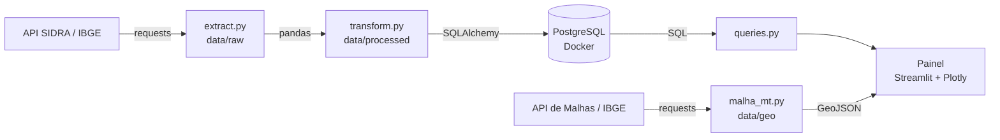
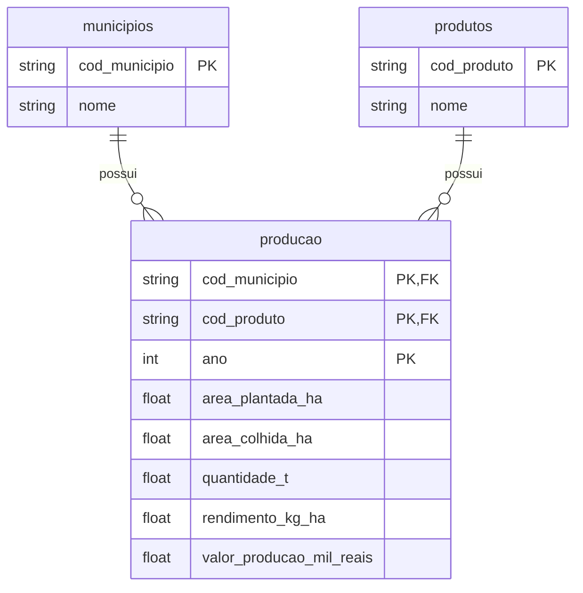

# 🌾 Produção Agrícola de Mato Grosso

Pipeline de dados completo (ETL) com a produção agrícola dos 142 municípios de
Mato Grosso, a partir dos dados oficiais do IBGE. Os dados são extraídos da API
SIDRA, tratados com pandas, armazenados em PostgreSQL (Docker) e apresentados
em um painel interativo com Streamlit, que inclui um **mapa por município**
construído com a malha territorial do IBGE.


## 📊 Destaques dos dados

- A produção de **soja em MT cresceu 2,7 vezes** entre 2010 e 2025, de 18,8
  para 50,2 milhões de toneladas, com a área dobrando e o rendimento subindo
  de ~3.000 para ~3.900 kg/ha.
- **Sorriso** é o maior produtor de soja do estado (2,34 milhões de t em 2025),
  mas responde por apenas **4,7%** do total: a produção é distribuída entre
  muitos municípios de grande porte.
- Em **2024**, a produção de soja caiu 14% mesmo com aumento de área, com
  forte queda no rendimento médio.
- O **algodão** gera cerca de **R$ 19,5 mil por hectare**, quase três vezes a
  soja, e é produzido em menos da metade dos municípios.
- Em peso, o **milho** supera a soja (54,3 × 50,2 milhões de t em 2025), mas
  vale menos da metade: boa parte é a "safrinha", plantada na mesma terra
  após a colheita da soja.

## 🖥️ O painel

| Aba | O que mostra |
|---|---|
| 🏆 Ranking | Maiores municípios produtores da cultura e safra escolhidas, com participação no estado |
| 🗺️ Mapa | Mapa coroplético de MT por município: produção, área colhida, rendimento ou valor da produção |
| 📈 Evolução | Série histórica de 2010 a 2025 para o estado ou para um município |
| 🌱 Comparação | Área plantada, valor da produção e valor por hectare de todas as culturas |
| ℹ️ Sobre os dados | Notas metodológicas e cuidados na leitura |

Os indicadores (KPIs) no topo mostram a variação em relação à safra anterior.

## 🏗️ Arquitetura



| Etapa | Módulo | O que faz |
|---|---|---|
| Extração | `src/extract.py` | Consulta a API SIDRA (tabela 5457) por cultura e salva o dado bruto |
| Transformação | `src/transform.py` | Converte tipos, trata valores ausentes, pivota para formato largo e valida |
| Carga | `src/load.py` | Grava em 3 tabelas relacionais, com carga completa em transação |
| Malha territorial | `src/malha_mt.py` | Baixa os contornos dos municípios de MT (GeoJSON), valida e salva localmente |
| Validação geográfica | `src/validar_codigos.py` | Confere se os códigos IBGE da malha correspondem aos do banco |
| Geometria | `src/geo.py` | Ajusta a orientação dos polígonos para o formato exigido pelo Plotly |
| Análise | `src/queries.py` + `sql/` | Consultas SQL parametrizadas usadas pelo painel |
| Visualização | `app/app.py` | Painel com KPIs, ranking, mapa, evolução e comparação entre culturas |

## 🛠️ Stack

- **Python 3.12** · requests · pandas
- **PostgreSQL 16** em Docker (docker compose)
- **SQLAlchemy 2.0** (ORM para modelagem, Core para consultas) · psycopg 3
- **Streamlit** + **Plotly** para o painel e o mapa (GeoJSON)
- **Git/GitHub** para versionamento

## 📁 Estrutura do projeto

```
producao_agricola_mt/
├── app/
│   └── app.py              # painel Streamlit
├── data/
│   ├── raw/                # dados brutos da API (não versionados)
│   ├── processed/          # dados tratados (não versionados)
│   └── geo/                # malha municipal de MT em GeoJSON (versionada)
├── docs/
│   └── mapa.png            # imagem usada neste README
├── sql/                    # consultas de análise (.sql)
├── src/
│   ├── config.py           # configurações centrais (códigos IBGE, caminhos, banco)
│   ├── extract.py          # extração
│   ├── transform.py        # transformação e validação
│   ├── models.py           # modelos das tabelas (SQLAlchemy)
│   ├── load.py             # carga no banco
│   ├── queries.py          # execução das consultas
│   ├── pipeline.py         # executa extração + transformação + carga
│   ├── malha_mt.py         # extração da malha municipal (API de Malhas do IBGE)
│   ├── validar_codigos.py  # validação malha × banco
│   └── geo.py              # utilidades geográficas (orientação dos polígonos)
├── docker-compose.yml      # PostgreSQL
├── .env.example            # modelo das variáveis de ambiente
└── requirements.txt
```

## 🗄️ Modelo de dados

Modelo estrela simplificado: uma tabela de fatos com os números da produção e
duas tabelas de cadastro.



A chave primária composta (município + cultura + ano) impede registros
duplicados diretamente no banco. O código IBGE do município (`cod_municipio`,
7 dígitos) é também a chave que liga os dados do banco aos contornos do mapa.

## 🚀 Como executar

**Pré-requisitos:** Python 3.12+, Docker com Docker Compose e Git.

**1. Clonar o repositório**
```bash
git clone https://github.com/oneriodev/producao_agricola_mt.git
cd producao_agricola_mt
```

**2. Criar o ambiente virtual e instalar as dependências**
```bash
python3 -m venv .venv
source .venv/bin/activate        # Linux/Mac
# .venv\Scripts\Activate.ps1     # Windows (PowerShell)
pip install -r requirements.txt
```

**3. Configurar as variáveis de ambiente**
```bash
cp .env.example .env             # Linux/Mac
# copy .env.example .env         # Windows
```
Edite o `.env` e defina uma senha para o banco.

**4. Subir o PostgreSQL**
```bash
docker compose up -d
```
O banco fica acessível apenas a partir da própria máquina (`127.0.0.1`).

**5. Rodar o pipeline** (extração, transformação e carga)
```bash
python -m src.pipeline
```

**6. (Opcional) Baixar e validar a malha municipal**

A malha já vem versionada em `data/geo/`. Para baixá-la de novo, apague o
arquivo e rode:
```bash
python -m src.malha_mt
python -m src.validar_codigos
```

**7. Abrir o painel**
```bash
python -m streamlit run app/app.py
```
O painel abre em `http://localhost:8501`.

## 🧠 Decisões técnicas

**Pipeline e banco**

- **Dado bruto preservado:** a extração salva a resposta da API sem alterações.
  Se a transformação mudar, basta reprocessar, sem consultar a API de novo.
- **Tratamento de valores ausentes seguindo o padrão do IBGE:** `-` significa
  zero e vira `0`; `...` significa dado não disponível e vira `NULL`.
  Transformar tudo em zero distorceria médias e séries históricas.
- **Validação na transformação:** o pipeline confere o número de linhas,
  duplicatas e valores negativos, e interrompe a execução se algo falhar.
- **Carga idempotente:** as tabelas são esvaziadas e recarregadas dentro de
  uma transação. Rodar o pipeline várias vezes sempre produz o mesmo
  resultado, e uma falha no meio não deixa o banco vazio.
- **SQL parametrizado:** os filtros do painel são passados como parâmetros,
  nunca concatenados no texto do SQL, o que evita SQL injection.
- **Rendimento como média ponderada:** o rendimento do estado é calculado
  como produção total ÷ área colhida total, e não como média simples dos
  municípios, que daria o mesmo peso a municípios pequenos e grandes.
- **Configuração centralizada:** códigos do IBGE, caminhos e credenciais
  ficam em `config.py` e `.env`. Incluir uma nova cultura exige mudar uma
  única linha.

**Mapa**

- **Validar antes de visualizar:** os códigos da malha (M) e do banco (B) são
  comparados com operações de conjuntos. M ∩ B são os municípios desenhados;
  B − M são municípios com dados mas sem contorno, que sumiriam do mapa sem
  aviso. Essa checagem encontrou um caso real (ver Limitações) e foi
  incorporada ao painel, que exibe o aviso automaticamente.
- **NULL não é zero no mapa:** a consulta parte da tabela de municípios com
  `LEFT JOIN`, com os filtros de cultura e ano na cláusula `ON` (no `WHERE`,
  eles transformariam a consulta em um `INNER JOIN` e descartariam os
  municípios sem dado). Municípios sem dado aparecem em cinza, e não como
  "produção zero".
- **Orientação dos polígonos:** o padrão GeoJSON (RFC 7946) usa contornos em
  sentido anti-horário, mas o Plotly espera o sentido horário. Sem ajuste,
  cada município é interpretado como "o planeta inteiro menos o município".
  O sentido de cada contorno é identificado pelo sinal da área calculada com
  a fórmula do laço (*shoelace*) e invertido quando necessário. A correção é
  feita ao carregar o mapa, mantendo o arquivo salvo no padrão oficial.
- **Malha local e idempotente:** a malha é baixada uma vez, validada e salva
  em `data/geo/`. O painel não depende da API do IBGE para funcionar.

**Segurança**

- **Credenciais fora do código:** senhas e dados de conexão ficam no `.env`,
  que não é versionado.
- **Banco acessível só localmente:** a porta do PostgreSQL é publicada em
  `127.0.0.1`. No Linux, portas publicadas pelo Docker em `0.0.0.0` ficam
  expostas à rede mesmo com o firewall (`ufw`) ativo.

## ⚠️ Limitações e cuidados na leitura

- Os dados de **2025 são preliminares** e podem ser revisados pelo IBGE.
- O **valor da produção está em reais correntes**, sem correção pela inflação.
- A **área plantada** pode ser contada mais de uma vez quando há cultivos
  sucessivos na mesma terra (ex.: milho safrinha após a soja).
- **Boa Esperança do Norte** é um município recém-criado e só possui dados
  a partir de 2025. Municípios vizinhos podem apresentar redução de área
  nesse ano por mudança de território, e não por queda de produção.
- **No mapa**, Boa Esperança do Norte ainda não aparece, pois não consta na
  malha do IBGE utilizada (141 municípios). Por isso, em 2025, o contorno de
  Sorriso ainda inclui a área do novo município. Os dados dele aparecem
  normalmente nas demais abas.

## 🔭 Próximos passos

- Cruzar a produção com dados de clima (chuva e temperatura por safra).
- Previsão de produtividade com modelos de Machine Learning.
- Testes automatizados (pytest) e verificação de código (ruff) com GitHub Actions.

## 📚 Fonte dos dados

- IBGE – Produção Agrícola Municipal (PAM), tabela 5457:
  [sidra.ibge.gov.br/tabela/5457](https://sidra.ibge.gov.br/tabela/5457)
- IBGE – API de Malhas Territoriais (contornos dos municípios):
  [servicodados.ibge.gov.br/api/docs/malhas](https://servicodados.ibge.gov.br/api/docs/malhas?versao=3)

## 👤 Autor

**Onerio** – estudante de Engenharia de Software, com foco em Python e dados.
